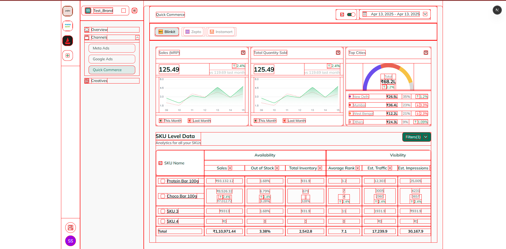

# Quick Commerce Dashboard

A modern e-commerce analytics dashboard built with Next.js, featuring real-time data visualization and SKU management.



## 🚨 Important Notice

For the best experience:
- Use a viewport width of 440px
- Zoom out browser if needed
- Or use dev tools to adjust viewport
- This is a non-responsive design (task requirement)

## 🎥 Demo

### [Live Demo](https://quickcommerce-black.vercel.app/)

Try out the live version of Quick Commerce Dashboard. The demo showcases all features including:
- Real-time data visualization
- SKU management interface
- Analytics dashboard
- Interactive tables and charts

> **Note**: Remember to set viewport to 440px for optimal viewing experience

## 🛠️ Tech Stack

- **Framework:** Next.js 14 (App Router)
- **Styling:** Tailwind CSS
- **State Management:** Redux Toolkit
- **Tables:** TanStack Table v8
- **Charts:** Recharts
- **UI Components:** Shadcn/ui
- **Icons:** React Icons, Lucide Icons

## ✨ Features

- **SKU Management**
  - Detailed SKU tracking
  - Checkbox selection
  - Sortable columns
  
- **Analytics**
  - Sales metrics
  - Inventory tracking
  - Out of stock monitoring
  - Traffic analysis
  
- **Data Visualization**
  - Line charts
  - Gauge charts
  - Percentage indicators
  - Trend arrows

## 🚀 Quick Start

1. **Clone the repository**
   ```bash
   git clone [repository-url]
   ```

2. **Install dependencies**
   ```bash
   npm install
   ```

3. **Run development server**
   ```bash
   npm run dev
   ```

4. **Open in browser**
   Visit [http://localhost:3000](http://localhost:3000)

## 💡 Developer Notes

### CSS Debugging
To view element alignments, uncomment this in globals.css:
```css
/* * {
  outline: 1px solid red;
  outline-offset: -1px;
} */
```

### Component Structure
- `MainWrapper` - Main layout container
- `Tables` - Data grid component
- `DisclaimerDialog` - Initial warning dialog
- Redux store for state management

## 🔗 Links

- [Figma Design](https://www.figma.com/design/6Y9bfEXlR5SDo2NfOmmUJP/Dcluttr---Design-task-file?node-id=21-9998&t=Eb4CTGjLPmEuiy9t-0)
- [GitHub Profile](https://github.com/Tonystarq)
- [LinkedIn](https://www.linkedin.com/in/manish-yadav-b325667a/)

## 📊 Data Structure

### Table Headers
- SKU Name
- Availability Section
  - Sales
  - Out of Stock
  - Total Inventory
- Visibility Section
  - Average Rank
  - Est. Traffic
  - Est. Impressions
  - CI

### State Management
- Loading states
- Table selection
- Sort orders
- Visibility toggles

## 🎨 Styling Details

- Custom color scheme
- Consistent spacing
- Proper alignments
- Hover states
- Selection states

## ⚠️ Known Limitations

1. Non-responsive design (task requirement)
2. Fixed viewport width (440px optimal)
3. Specific browser compatibility

## 🤝 Contributing

Feel free to:
1. Fork the repository
2. Create a feature branch
3. Submit pull requests

## 📝 License

This project is private and proprietary.

## 👨‍💻 Author

Manish Yadav
- [GitHub](https://github.com/Tonystarq)
- [LinkedIn](https://www.linkedin.com/in/manish-yadav-b325667a/)
